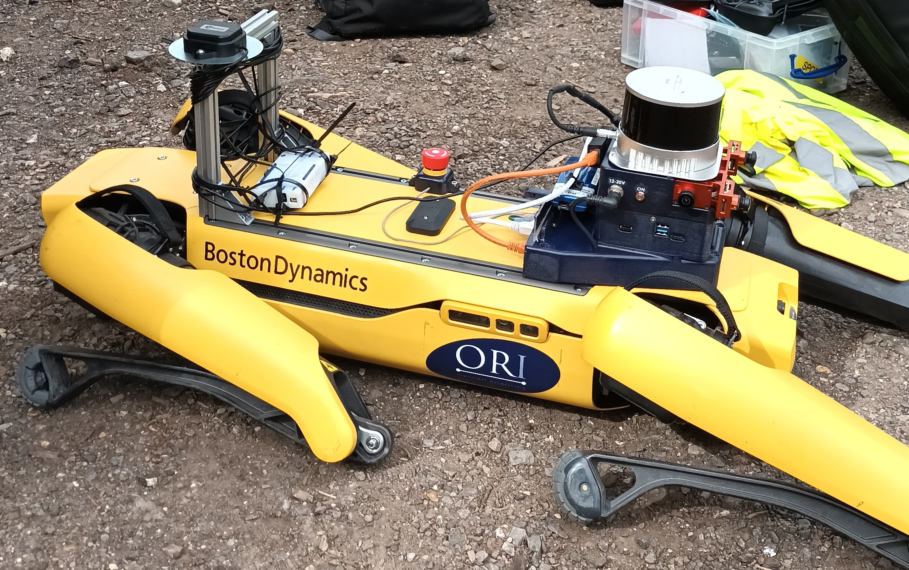
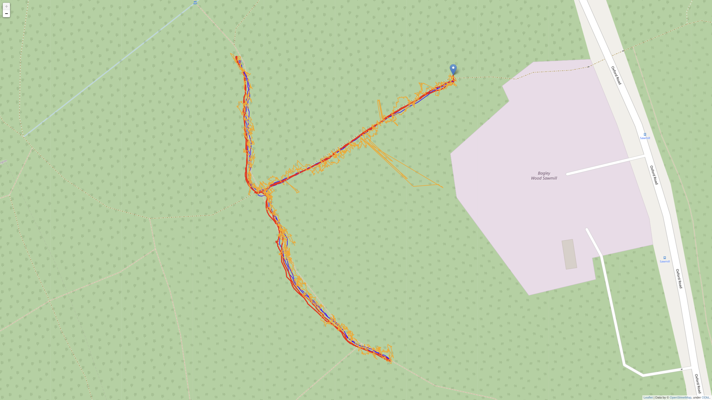

# raw-gnss-fusion

*Author: Jonas Beuchert*

This repository might accompany a future publication where we present an approach to fuse raw GNSS data with other sensing modalities (IMU and lidar) using a factor graph.
The goal is to localize a mobile robot in the global Earth frame without drift and discontinuity.
The GNSS data is not only used to anchor the robot's trajectory in the global Earth frame and to eliminate drift, but also for highly accurate local positioning using the carrier-phase observations of a GNSS receiver.
However, we do not require a base station as differential GNSS methods normally do.

This repository contains three pieces of work that do not depend on each other:

1. [Demo code for our carrier-phase factors](#demo-code-for-our-carrier-phase-factors)

2. [Instructions how to use our public robot dataset with GNSS, IMU, an lidar data](#instructions-how-to-use-our-public-robot-dataset-with-gnss-imu-and-lidar-data)

3. [Results of our method on various datasets](#results-of-our-method-on-various-datasets)

# Demo code for our carrier-phase factors

This repository contains a demo script that shows how carrier-phase observations from a GNSS receiver can be used in factor-graph optimization for accurate local/relative localization of a moving platform.
Specifically, we create time-relative double-differential carrier-phase factors between different states in time.

This is not our real-time code. Just a script to demonstrate the concept.

## Setup

The script is written in Python using the GTSAM library for the optimization and the GPSTk library for the GNSS processing.
It was tested with Python 3.7 on Ubuntu 20.04.5 LTS (Focal Fossa).
The data comes in u-blox' UBX format.

### 1. Install dependencies via apt

Open terminal.

```shell
apt update
apt install -y cmake git swig wget libtbb-dev libboost-all-dev pip
```

### 2. Install Python 3.7 via Miniconda

```shell
mkdir raw-gnss-fusion-libs
cd raw-gnss-fusion-libs
wget https://repo.anaconda.com/miniconda/Miniconda3-py37_4.10.3-Linux-x86_64.sh
bash Miniconda3-py37_4.10.3-Linux-x86_64.sh
exit
```
When prompted, respond with: *enter* - *yes* - *enter* - *yes*

Might work with other Python versions; just not tested.

### 3. Install GPS Toolkit

Re-open terminal.

```shell
cd raw-gnss-fusion-libs
git clone https://github.com/SGL-UT/GPSTk.git
cd GPSTk
./build.sh -ue
cd ..
```

Make sure that the installation uses the correct Python version, i.e., the one which you installed in step 2.

### 4. Install GTSAM

```shell
git clone https://github.com/borglab/gtsam.git
cd gtsam
python3.7 -m pip install -r python/requirements.txt
python3.8 -m pip install -r python/requirements.txt
mkdir build
cd build
cmake .. -DGTSAM_BUILD_PYTHON=1 -DGTSAM_PYTHON_VERSION=3.7
make python-install
cd ../..
```

We need to build from source since rather recent features are required.

Make sure that the installation uses the correct Python version, i.e., the one which you installed in step 2. This can be a bit confusing since Ubuntu 20.04's system Python 3.8 will be used in the installation process, but Python 3.7 from step 2 is the target.

### 5. Clone this repository and install requirements

```shell
git clone https://github.com/JonasBchrt/raw-gnss-fusion.git
python3.7 -m pip install pyubx2==1.1.7 matplotlib numpy geographiclib pymap3d folium pynmea2 bagpy
```

### 6. Run the script

```shell
cd raw-gnss-fusion
python3.7 demo_timerelative_carrierphase_factor_zed_f9p.py
```

*TODO.*

# Instructions how to use our public robot dataset with GNSS, IMU, and lidar data

This sequence is a different one than the one used above.
A quadruped robot moved through a dense commercial forest.
This is known to be challenging for satellite navigation due to the very limited sky visibility, many outliers in the GNSS measurements because of signal reflections by surrounding vegetation (multi-path effect), and signal degradation caused by the electromagnetic interference of the robot with the GNSS signals.

[Link to dataset.](https://drive.google.com/drive/folders/1VqBe_JhoEwWgVNoIUkqhxmJCWm7UPKhm?usp=sharing)

The data comes as three consecutive rosbags.

### Setup
* Platform: BostonDynamics Spot
* Lidar: HESAI XT32
* IMU: Bosch BMI0856 (part of Sevensense Alphasense)
* GNSS receiver: u-blox C099-F9P
* GNSS antenna: u-blox ANN-MB-00



### Geometry
* IMU in base frame (position as [x y z] vector): `B_r_BI: [0.516857, 0.043450, -0.092900]`
* IMU in base frame (orientation as [x y z w] quaternion): `q_BI: [0.999998, 0.000000, -0.001745, 0.000000]`
* Lidar in base frame (position as [x y z] vector): `B_r_BL: [0.479112, 0.052000, -0.019785]`
* Lidar in base frame (orientation as [x y z w] quaternion): `q_BL: [0.001234, 0.001234, 0.707106, 0.707106]`
* GNSS antenna in base frame (position as [x y z] vector): `B_r_BA: [0.0, 0.0, 0.0]`
* GNSS antenna in base frame (orientation as [x y z w] quaternion): `q_BA: [0.0, 0.0, 0.0, 1.0]`

### Recording rates
* Lidar: 10 Hz
* IMU: 200 Hz
* GNSS: 5 Hz

### Recording software
* Operating System: Ubuntu 20.04.5 LTS
* IMU driver: alphasense_driver_ros
* GNSS driver: [ublox_driver](https://github.com/ori-drs/ublox_driver)

### ROS topics
* IMU: `/alphasense_driver_ros/imu` of type `sensor_msgs/Imu`
* Lidar: `/hesai/pandar` of type `sensor_msgs/PointCloud2`
* Raw GNSS: `/ublox_driver/range_meas` of type `gnss_comm/GnssMeasMsg`
* GNSS on-board fixes (DGNSS/RTK): `/ublox_driver/receiver_lla` of type `sensor_msgs/NavSatFix` or `/ublox_driver/receiver_pvt` of type `gnss_comm/GnssPVTSolnMsg`

### IMU parameters
* Accelerometer noise standard deviation: `0.0014929303436999736`
* Accelerometer bias random walk standard deviation: `6.883010680707546e-05`
* Gyroscope noise standard deviation: `0.00029824119649206544`
* Gyroscope bias random walk sigma: `1.2013119882828282e-06`
* Gravity vector: `[0, 0, -9.808083883386614]`

### Notes
* IMU and lidar have a timeshift of 9.062 s w.r.t. the GNSS.
* The GNSS driver has a bug, it reported Galileo signals at frequency 1.2276 GHz, which should be at frequency 1.20714 GHz, the center frequency of Galileo's E5b band.

# Results of our method on various datasets

We implemented pseudorange, IMU, and lidar factors in addition to the carrier-phase factors described above and estimated trajectories on several sequences using the resulting optimization algorithm.
This includes the sequence above and further ones that we recorded or that are publicy available.

* Trajectory of a car in Hong Kong estimated with our algorithm fusing inertial and raw GNSS measurements (red) in comparison to RTK (ground truth, blue): [online map](https://users.ox.ac.uk/~kell5462/hong-kong.html), [file](hong-kong.html). Raw data from [GVINS Dataset](https://github.com/HKUST-Aerial-Robotics/GVINS-Dataset).


* Trajectory of a quadruped robot in the Bagley Wood estimated using inertial, raw GNSS, and lidar data (red) in comparison to RTK (ground truth, blue) and single GNSS fixes (orange): [online map](https://users.ox.ac.uk/~kell5462/bagley.html), [file](bagley.html).


* Trajectory of a hand-held GNSS receiver in Oxford estimated using carrier phases only: [online map](https://users.ox.ac.uk/~kell5462/nhm.html), [file](nhm.html).


* Trajectory of a car in Oxford estimated with our algorithm fusing inertial, raw GNSS, and lidar data (red) in comparison to RTK (ground truth, blue): [online map](https://users.ox.ac.uk/~kell5462/jericho.html), [file](jericho.html).


* Trajectory of a car in Oxford estimated with our algorithm fusing inertial and raw GNSS measurements (red) in comparison to RTK (ground truth, blue): [online map](https://users.ox.ac.uk/~kell5462/park-town.html), [file](park-town.html).

